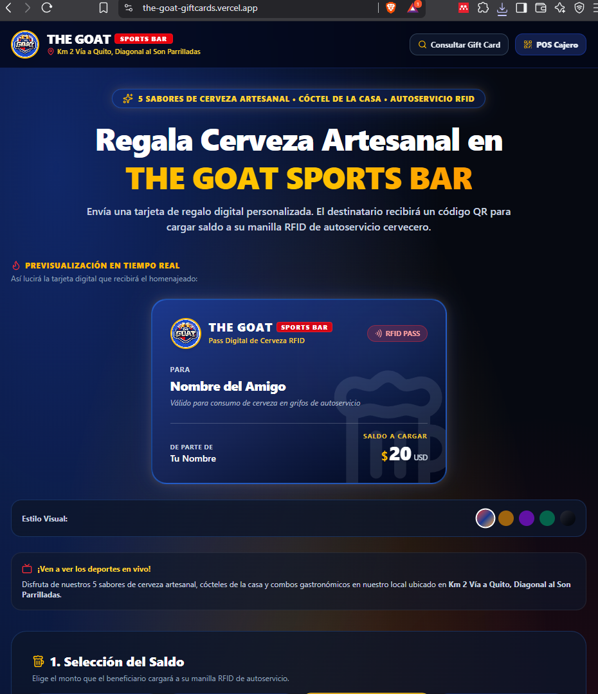
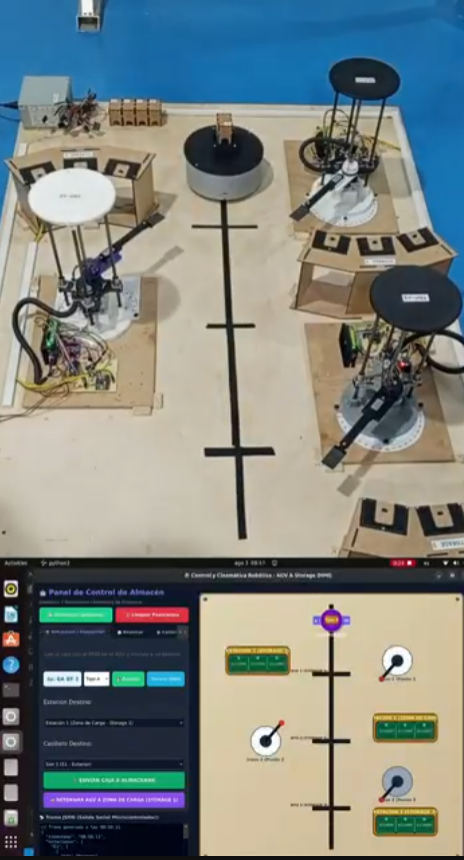
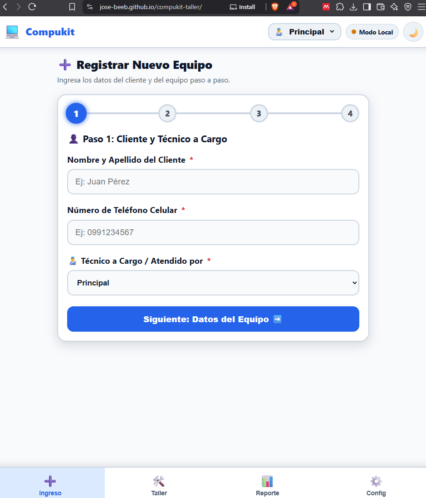
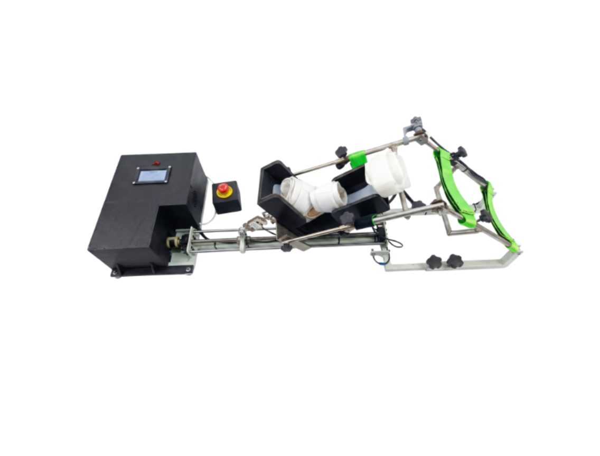
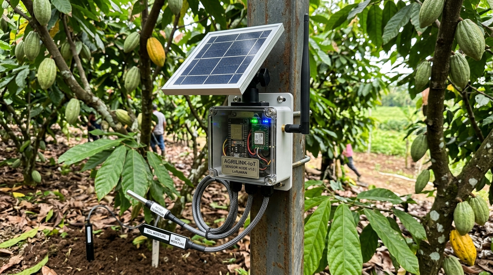
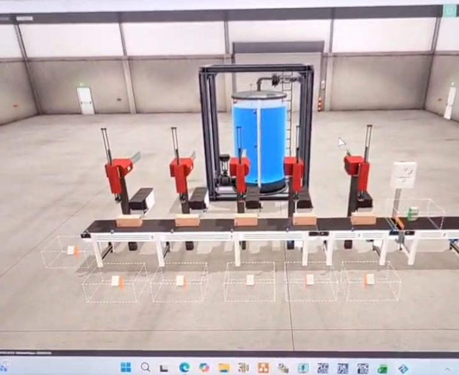
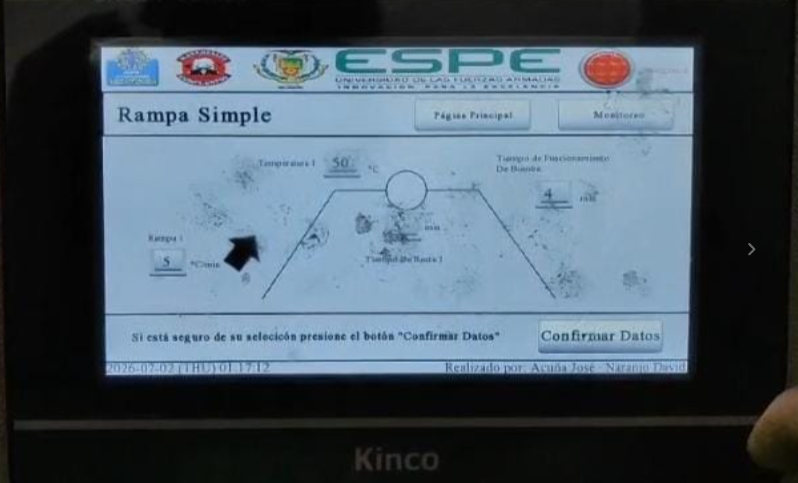

# 👋 ¡Hola! Soy José Andrés Acuña Herrera
### **Ingeniero Mecatrónico | Automatización Industrial, Sistemas Embebidos & IoT**

  <i>Apasionado por la convergencia entre hardware, algoritmos inteligentes y sistemas ciberfísicos para transformar la industria y la salud.</i>

---

## 👨‍💻 Sobre Mí

- 🎓 **Graduado en Ingeniería Mecatrónica** en la **Universidad de las Fuerzas Armadas ESPE** (Ecuador).
- 🔬 **Especializado en:** Diseño de sistemas ciberfísicos, instrumentación médica/industrial, automatización SCADA/PLC, redes de sensores IoT (LoRaWAN) y modelado dinámico.
- 🌐 **Líder Técnico & Comunitario:** Ex-Presidente de Rama Estudiantil IEEE ESPE, Lead Nacional de IEEEXtreme 19.0 y Vicepresidente de IEEE EMBS / RAS.
- 💡 **Filosofía de trabajo:** Ingeniería orientada al impacto real, rigor técnico y arquitectura modular desde el hardware hasta la nube.

---

## 🛠️ Stack Tecnológico & Herramientas

### ⚡ Sistemas Embebidos, IoT & Hardware

### 🏭 Automatización, PLC & SCADA

-00646E?style=flat-square)

### 🤖 Control, Robótica, IA & Simulación

-6C5CE7?style=flat-square)

### 📐 CAD, CAE & Prototipado

---

## 🚀 Proyectos Destacados

<table>
  <tr>
    <td width="50%" valign="top">
      
      <h3>🍺 <a href="https://the-goat-giftcards.vercel.app">THE GOAT — Gift Cards & RFID Tap-Beer</a></h3>
      
Plataforma Fullstack en producción para venta online de gift cards digitales, generación criptográfica SHA-256 (24 bytes) y módulo PWA POS con escáner QR anti-rebote para abono RFID en bares de autoservicio.

      <ul>
        <li><b>🌐 Demo en Vivo:</b> <a href="https://the-goat-giftcards.vercel.app">the-goat-giftcards.vercel.app</a></li>
        <li><b>Stack:</b> Next.js, React, TypeScript, Tailwind CSS, Vercel.</li>
        <li><b>Base de Datos & Seguridad:</b> Supabase (PostgreSQL + RLS + RPC atómico <code>redeem_gift_card</code> con <code>FOR UPDATE</code>).</li>
        <li><b>PWA POS:</b> Escáner QR (<code>html5-qrcode</code>), Web Audio API y cerrojo anti-rebote.</li>
        <li><b>Mailing:</b> Nodemailer híbrido (Gmail SMTP + Resend API).</li>
        <li><b>Código:</b> <i>🔒 Repositorio Privado / Comercial</i></li>
      </ul>
    </td>
    <td width="50%" valign="top">
      
      <h3>🤖 Sistema Robótico de Almacenamiento & AGV (AS/RS)</h3>
      
Simulador cinemático y suite de monitoreo para prototipo logístico automatizado con 3 brazos robóticos, casilleros curvados (9 slots) y plataforma móvil AGV sobre pista guiada central.

      <ul>
        <li><b>▶ Video Demo:</b> <a href="https://youtu.be/2pD4KcC07y4">Ver Funcionamiento en YouTube</a></li>
        <li><b>Software & GUI:</b> Python con interfaz modular en PyQt6.</li>
        <li><b>Control & Cinemática:</b> Despacho directo HOME ➔ Slot, reubicación coordinada entre estaciones y simulación de tags RFID (A-E).</li>
        <li><b>Comunicaciones:</b> Generador de tramas seriales JSON para microcontroladores y validaciones modales de seguridad (QMessageBox).</li>
        <li><b>Código:</b> <i>🔒 Repositorio Privado</i></li>
      </ul>
    </td>
  </tr>
  <tr>
    <td width="50%" valign="top">
      
      <h3>🛠️ <a href="https://jose-beeb.github.io/compukit-taller/">Compukit Taller — PWA & Gestión Offline</a></h3>
      
Sistema Web Progresivo para órdenes de servicio técnico de hardware con arquitectura <i>offline-first</i>, dictado por voz y sincronización automática en la nube.

      <ul>
        <li><b>🌐 App en Vivo:</b> <a href="https://jose-beeb.github.io/compukit-taller/">jose-beeb.github.io/compukit-taller</a></li>
        <li><b>Frontend:</b> PWA instalable, Service Workers, Web Speech API y compresión Canvas.</li>
        <li><b>Backend & Sync:</b> Google Apps Script + Google Drive/Sheets + cola LocalStorage.</li>
        <li><b>Código:</b> <a href="https://github.com/Jose-beeb/compukit-taller">github.com/Jose-beeb/compukit-taller</a></li>
      </ul>
    </td>
    <td width="50%" valign="top">
      
      <h3>🦿 Exoesqueleto / Rehabilitador Robótico de Rodilla</h3>
      
Dispositivo mecatrónico activo/pasivo para rehabilitación de miembros inferiores con telemetría en tiempo real.

      <ul>
        <li><b>▶ Video Demo:</b> <a href="https://youtu.be/Myn2MfTO_Dw">Ver Demostración Biomecánica en YouTube</a></li>
        <li><b>Hardware:</b> Raspberry Pi 5, ESP32, NEMA 23 + husillo, encoder AS5600 y celda HX711.</li>
        <li><b>Control & IA:</b> Control Difuso adaptativo y clasificación con Random Forest.</li>
        <li><b>Simulación:</b> Modelado dinámico en MATLAB Simulink/Simscape.</li>
      </ul>
    </td>
  </tr>
  <tr>
    <td width="50%" valign="top">
      
      <h3>🌾 Lora Kipu — Red IoT AgriTech <i>(Render Conceptual)</i></h3>
      
Red de nodos sensores de ultra bajo consumo para monitoreo microclimático y prevención de plagas en cultivos de cacao con ESP32, LoRaWAN y backend FastAPI.

    </td>
    <td width="50%" valign="top">
      
      <h3>🏭 Gemelo Digital & SCADA de Manufactura</h3>
      
Celda de manufactura virtualizada con PLC Siemens S7-1200/1500 (SCL en TIA Portal), integración OPC UA y supervisión SCADA en Ignition Designer.  ▶ <b><a href="https://youtube.com/shorts/luxnUp_XqdI">Ver Simulación en YouTube Shorts</a></b>

    </td>
  </tr>
  <tr>
    <td colspan="2" valign="top">
      
      <h3>🔥 Reacondicionamiento de Horno de Curado Aeroespacial (CIDFAE)</h3>
      
Modernización de potencia, control térmico e interfaz HMI en Kinco DTools v4.5.6 con monitoreo remoto VNC para procesamiento de compuestos en I+D aeroespacial.  ▶ <b><a href="https://youtube.com/shorts/quRxPrLFzec">Ver Operación de Horno en YouTube Shorts</a></b>

    </td>
  </tr>
</table>

---

## 🏆 Liderazgo y Reconocimientos

- 🌍 **Ecuador Section Lead:** IEEEXtreme 19.0 — Coordinación nacional de la competencia global de programación.
- 🏛️ **Presidente de Rama Estudiantil:** IEEE Universidad de las Fuerzas Armadas ESPE (2025 - 2026).
- 🇬🇧 **Cambridge Certified:** *Global Leadership and Business Certification* — Clare College, University of Cambridge (2025).
- 🧬 **Vicepresidente de Capítulo:** IEEE EMBS (Engineering in Medicine and Biology Society) ESPE.
- 🤖 **Ex-Vicepresidente & Secretario:** IEEE RAS (Robotics and Automation Society) ESPE.
- 🌟 **LÍDER LAB 2026:** Seleccionado por la *Corporación Líderes para Gobernar*.

---

## 📊 Estadísticas de GitHub

  
  

  

---

## 📬 Conectemos

¿Tenés algún proyecto de mecatrónica, IoT o automatización en mente, o te gustaría colaborar en investigación y desarrollo?

- 📧 **Correo:** [jaacunainusa@gmail.com](mailto:jaacunainusa@gmail.com) / [jaacuna@ieee.org](mailto:jaacuna@ieee.org)
- 💼 **LinkedIn:** [linkedin.com/in/joseacuñah](https://linkedin.com/in/joseacuñah)
- 📄 **Curriculum Vitae:** [Leer CV en Markdown](./cv.md)
